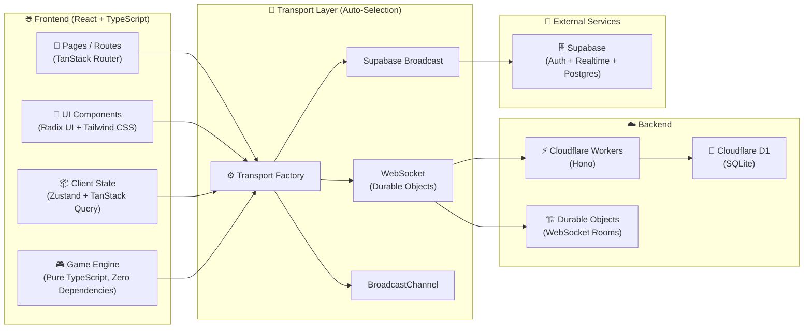

# 🃏 WildCards — UNO Online

<p align="center">
  <strong>A production-quality, browser-based multiplayer UNO experience.</strong><br/>
  Play with friends or bots in real time — no downloads and no accounts required.
</p>

<p align="center">
  <a href="https://wildcards.itzbyteglitch.qzz.io">🌐 Live Demo</a> •
  <a href="https://github.com/ItzByteGlitch/WildCards/issues">🐛 Issues</a> •
  <a href="LICENSE">📄 MIT License</a>
</p>

<p align="center">
  
  
  
  
  
  
  
</p>

---

## ✨ What is WildCards?

**WildCards** is a full-stack, browser-based multiplayer UNO game built around real-time communication, a server-authoritative game engine, responsive UI, and flexible networking fallbacks.

The project is designed to feel like a polished game rather than a simple browser clone — from animated UI and smart bots to persistent player statistics and cross-device multiplayer.

### 🔗 Quick Links

| Resource | Link |
| --- | --- |
| **Live Game** | https://wildcards.itzbyteglitch.qzz.io |
| **Repository** | https://github.com/ItzByteGlitch/WildCards |
| **License** | MIT |

---

## 🎮 Features

- ⚡ **Real-time Multiplayer** — WebSocket-powered rooms with Cloudflare Durable Objects
- 🌐 **Cross-device Play** — Desktop, tablet, and mobile browsers
- 🤖 **Smart Bots** — AI opponents with strategic play
- 👤 **Guest Login** — Join instantly with a username and avatar
- 🔐 **Room System** — Private/public rooms with 6-letter invite codes
- 🃏 **Complete UNO Rules** — Draw, Skip, Reverse, Draw Two, Wild, and Wild Draw Four
- ⏱️ **Turn Timer** — Configurable turn limits with visual feedback
- 🏆 **Stats & Leaderboard** — Wins, scores, and persistent local profile data
- 🌓 **Dark / Light Mode** — System-aware theming
- 📱 **Responsive UI** — Designed for different screen sizes
- ♿ **Accessibility** — Keyboard navigation and screen-reader-friendly UI
- ☁️ **Free-Tier Friendly** — Designed around free hosting infrastructure

---

## 🧠 AI-Assisted Development

AI was integrated throughout the development process — from **planning and architecture to coding, debugging, UI refinement, and testing**.

### 01 — Custom AI Agent

Our own AI coding agent, **inspired by Claude Code™**, customized around our development workflow. It is currently in **beta and not publicly released**.

### 02 — Multi-Model Engineering

Different AI models were used for different workloads, including:

- **NVIDIA Nemotron 3 Ultra**
- **NVIDIA Nemotron Nano 12B v2 VL**
- **Cohere North Mini Code**
- **Kimi K2.7 Code**
- **MiniMax M3**
- **ChatGPT**

### 03 — Automated Review Workflow

We implemented a workflow that **visually inspects the UI and analyzes application logs** to identify errors, inconsistencies, and design imperfections. This helped continuously refine both **functionality and user experience**.

### Human Oversight

We did not use AI blindly. We **reviewed, tested, verified, and understood its outputs** before integrating them into the project.

> **The skill is not just using AI — it is knowing how to use it correctly, efficiently, and ethically.**

**AI accelerated our development. Human judgment remained responsible for the final decisions.**

---

## 🏗️ Architecture



### Transport Strategy

The networking layer automatically selects the best available transport:

1. **WebSocket + Durable Objects** — Primary real-time transport
2. **Supabase Broadcast** — Realtime fallback when Supabase is configured
3. **BroadcastChannel** — Same-browser cross-tab fallback

All transports implement the same interface, allowing the game engine and UI to remain independent of the underlying networking implementation.

---

## 🧰 Tech Stack

| Layer | Technologies |
| --- | --- |
| **Frontend** | React 19, TypeScript, Vite, TanStack Router, TanStack Query, Zustand |
| **UI** | Tailwind CSS 4, Radix UI, Framer Motion |
| **Backend** | Cloudflare Workers, Hono, Durable Objects |
| **Database** | Cloudflare D1 (SQLite), Supabase/Postgres fallback |
| **Realtime** | WebSockets, Supabase Broadcast, BroadcastChannel |
| **Authentication** | Guest sessions, JWT tokens, Supabase Auth ready |
| **Deployment** | Cloudflare Pages + Cloudflare Workers |
| **Tooling** | ESLint, Prettier, TypeScript, TanStack Start, pnpm |

---

## 🎯 Game Engine

The UNO engine in `src/lib/uno/` is completely decoupled from the UI.

- **Pure TypeScript** — No React, DOM, or UI dependencies
- **Server-authoritative** — Clients send intents; the server validates them
- **Deterministic** — Same seed produces the same shuffle
- **Testable** — Can be unit-tested independently of the browser

```typescript
import { createGame, applyAction } from "@/lib/uno/engine";

const seats = [
  { id: "p1", name: "Alice", avatar: "🐱", isBot: false },
  { id: "p2", name: "Bob", avatar: "🤖", isBot: true },
];

const game = createGame(seats);

const { state, error } = applyAction(game, {
  type: "play",
  playerId: "p1",
  cardId: "card_123",
});
```

---

## 📁 Project Structure

```text
WildCards/
├── src/
│   ├── components/          # Reusable UI components
│   │   ├── ui/              # Radix-based design system
│   │   ├── uno-card.tsx     # UNO card component
│   │   ├── game-board.tsx   # Game board layout
│   │   └── site-nav.tsx     # Navigation
│   ├── hooks/               # Custom React hooks
│   ├── integrations/        # External service integrations
│   │   └── supabase/        # Supabase client & auth
│   ├── lib/
│   │   ├── net/             # Transport abstractions
│   │   ├── uno/             # Pure TypeScript game engine
│   │   ├── rooms.server.ts
│   │   ├── rooms.functions.ts
│   │   ├── profile.ts
│   │   └── store/           # Zustand state
│   ├── routes/              # Application routes
│   ├── styles.css
│   └── server.ts
├── worker/                  # Cloudflare Worker backend
├── supabase/                # Supabase configuration/migrations
└── public/                  # Static assets
```

---

## 🚀 Getting Started

### Prerequisites

- **Node.js 22+**
- **pnpm 9+** (npm/yarn also work for local development)
- A **Cloudflare account** for deployment

### Installation

```bash
git clone https://github.com/ItzByteGlitch/WildCards.git
cd WildCards
pnpm install
pnpm run dev
```

The development server will be available at:

```text
http://localhost:5173
```

### Environment Variables

Create a `.env` file in the project root:

```env
VITE_SUPABASE_URL=your_supabase_url
VITE_SUPABASE_PUBLISHABLE_KEY=your_supabase_anon_key
VITE_REALTIME_WS_URL=wss://your-worker.your-subdomain.workers.dev
CLOUDFLARE_ACCOUNT_ID=your_account_id
CLOUDFLARE_API_TOKEN=your_api_token
```

---

## ☁️ Deployment

### Frontend — Cloudflare Pages

```bash
pnpm run build
npx wrangler pages deploy .output/public --project-name=wildcards
```

### Backend — Cloudflare Workers + Durable Objects

```bash
cd worker
pnpm install
npx wrangler deploy
```

Set `VITE_REALTIME_WS_URL` in your Pages environment variables to the deployed Worker URL.

### Database — Cloudflare D1

```bash
npx wrangler d1 create wildcards
npx wrangler d1 execute wildcards --file=./supabase/migrations/*.sql
```

---

## 📜 Scripts

| Command | Description |
| --- | --- |
| `pnpm dev` | Start development server |
| `pnpm build` | Create production build |
| `pnpm preview` | Preview production build |
| `pnpm lint` | Run ESLint |
| `pnpm format` | Format with Prettier |
| `pnpm typecheck` | Run TypeScript type checking |

---

## 🤝 Contributing

1. Fork the repository
2. Create a feature branch: `git checkout -b feature/amazing-feature`
3. Commit your changes
4. Push the branch
5. Open a Pull Request

Before submitting, make sure:

- `pnpm lint` passes
- `pnpm typecheck` passes
- New features include tests where appropriate
- Code follows the existing project style

---

## 📄 License

This project is licensed under the **MIT License**. See [`LICENSE`](LICENSE) for details.

> **UNO® is a registered trademark of Mattel. WildCards is an unofficial fan project and is not affiliated with Mattel.**

---

## 🙏 Acknowledgments

- **TanStack** — Router, Query, and Start
- **Radix UI** — Accessible component primitives
- **Cloudflare** — Edge infrastructure and free-tier hosting
- **Supabase** — Realtime infrastructure and database tooling

---

<p align="center">
  Built with ❤️, TypeScript, and AI-assisted engineering by<br/>
  <strong><a href="https://github.com/ItzByteGlitch">ItzByteGlitch (Divyansh Singh Patel)</a></strong>
</p>
