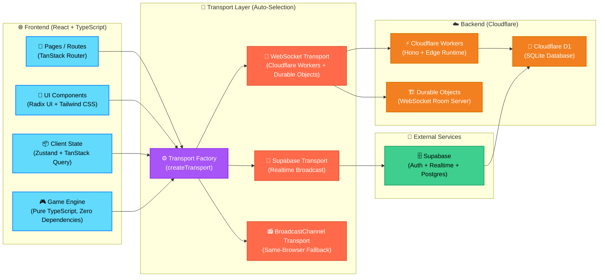

# WildCards — UNO Online

[](https://opensource.org/licenses/MIT)
[](https://www.typescriptlang.org/)
[](https://react.dev/)
[](https://vite.dev/)
[](https://tailwindcss.com/)
[](https://tanstack.com/router)
[](https://tanstack.com/query)
[](https://zustand-demo.pmnd.rs/)
[](https://workers.cloudflare.com/)
[](https://developers.cloudflare.com/d1/)
[](https://pages.cloudflare.com/)
[](https://supabase.com/)
[](https://developer.mozilla.org/en-US/docs/Web/API/WebSocket)
[](https://developers.cloudflare.com/durable-objects/)
[](https://eslint.org/)
[](https://prettier.io/)
[](https://nodejs.org/)
[](https://pnpm.io/)
[](https://github.com/itzbyteglitch/WildCards/actions/workflows/ci.yml)
[](https://wildcards.itzbyteglitch.qzz.io)

A production-quality, browser-based multiplayer UNO game built with React, TypeScript, and Cloudflare Workers. Play with friends or bots in real-time — no downloads, no accounts required.

## Features

- **Real-time Multiplayer** — WebSocket-powered rooms with Cloudflare Durable Objects
- **Cross-device Sync** — Play across desktop and mobile browsers
- **Smart Bots** — AI opponents with strategic play
- **Guest Login** — Jump in instantly with a username and avatar
- **Room System** — Create private/public rooms, invite by 6-letter code
- **Complete UNO Rules** — Draw, Skip, Reverse, Draw Two, Wild, Wild Draw Four
- **Turn Timer** — Configurable turn limits with visual indicator
- **Score Tracking** — Persistent stats, wins, leaderboard
- **Dark/Light Mode** — System-aware theming
- **Responsive Design** — Works on desktop, tablet, and mobile
- **Accessibility** — Keyboard navigation, screen reader support
- **Free Hosting** — Runs entirely on Cloudflare's free tier

## Tech Stack

| Category       | Technologies                                                                                                  |
| -------------- | ------------------------------------------------------------------------------------------------------------- |
| **Frontend**   | React 19, TypeScript, Vite, TanStack Router, TanStack Query, Zustand, Tailwind CSS 4, Framer Motion, Radix UI |
| **Backend**    | Cloudflare Workers, Durable Objects, D1 (SQLite), Hono                                                        |
| **Database**   | Cloudflare D1 (primary), Supabase (realtime fallback)                                                         |
| **Realtime**   | WebSockets (Durable Objects), Supabase Broadcast, BroadcastChannel (fallback)                                 |
| **Auth**       | Guest sessions, JWT tokens, Supabase Auth ready                                                               |
| **Deployment** | Cloudflare Pages (frontend), Cloudflare Workers (backend)                                                     |
| **Tooling**    | ESLint, Prettier, TypeScript, TanStack Start                                                                  |

## Architecture



## Getting Started

### Prerequisites

- Node.js 22+
- pnpm 9+ (or npm/yarn)
- Cloudflare account (for deployment)

### Installation

```bash
git clone https://github.com/ItzByteGlitch/WildCards.git
cd WildCards
pnpm install
pnpm run dev
```

The app will be available at `http://localhost:5173`.

### Environment Variables

Create a `.env` file in the root:

```env
VITE_SUPABASE_URL=your_supabase_url
VITE_SUPABASE_PUBLISHABLE_KEY=your_supabase_anon_key
VITE_REALTIME_WS_URL=wss://your-worker.your-subdomain.workers.dev
CLOUDFLARE_ACCOUNT_ID=your_account_id
CLOUDFLARE_API_TOKEN=your_api_token
```

## Project Structure

```
WildCards/
├── src/
│   ├── components/          # Reusable UI components
│   │   ├── ui/              # Radix-based design system
│   │   ├── uno-card.tsx     # UNO card component
│   │   ├── game-board.tsx   # Game board layout
│   │   └── site-nav.tsx     # Navigation
│   ├── hooks/               # Custom React hooks
│   ├── integrations/        # External service integrations
│   │   └── supabase/        # Supabase client & auth
│   ├── lib/
│   │   ├── net/             # Transport abstractions
│   │   │   ├── transport.ts
│   │   │   ├── create-transport.ts
│   │   │   ├── websocket-transport.ts
│   │   │   ├── supabase-transport.ts
│   │   │   └── broadcast-transport.ts
│   │   ├── uno/             # Game engine (pure TypeScript)
│   │   │   ├── types.ts
│   │   │   ├── deck.ts
│   │   │   ├── engine.ts
│   │   │   ├── bot.ts
│   │   │   └── redact.ts
│   │   ├── rooms.server.ts
│   │   ├── rooms.functions.ts
│   │   ├── profile.ts
│   │   └── store/           # Client state (Zustand)
│   ├── routes/
│   │   ├── index.tsx
│   │   ├── play.tsx
│   │   ├── lobby.tsx
│   │   ├── room.$code.tsx
│   │   ├── profile.tsx
│   │   ├── leaderboard.tsx
│   │   └── how-to-play.tsx
│   ├── styles.css
│   └── server.ts
├── worker/
│   └── src/index.ts
├── supabase/
└── public/
```

## Game Engine

The UNO engine (`src/lib/uno/`) is completely decoupled from the UI:

- **Pure TypeScript** — No React, no DOM, no side effects
- **Server-authoritative** — Clients send intents, server validates
- **Deterministic** — Same seed = same shuffle
- **Testable** — Unit testable without browser

```typescript
import { createGame, applyAction } from "@/lib/uno/engine";

const seats = [
  { id: "p1", name: "Alice", avatar: "🐱", isBot: false },
  { id: "p2", name: "Bob", avatar: "🤖", isBot: true },
];
const game = createGame(seats);

const { state, error } = applyAction(game, {
  type: "play",
  playerId: "p1",
  cardId: "card_123",
});
```

## Realtime Transport

The transport layer automatically selects the best available backend:

1. **WebSocket (Durable Objects)** — If `VITE_REALTIME_WS_URL` configured
2. **Supabase Broadcast** — If Supabase credentials present
3. **BroadcastChannel** — Same-browser cross-tab fallback

All implement the same `Transport` interface for seamless switching.

## Deployment

### Frontend (Cloudflare Pages)

```bash
pnpm run build
npx wrangler pages deploy .output/public --project-name=wildcards
```

### Backend (Cloudflare Workers + Durable Objects)

```bash
cd worker
pnpm install
npx wrangler deploy
```

Set `VITE_REALTIME_WS_URL` in your Pages environment variables to the Worker URL.

### Database (Cloudflare D1)

```bash
npx wrangler d1 create wildcards
npx wrangler d1 execute wildcards --file=./supabase/migrations/*.sql
```

## Scripts

| Command          | Description              |
| ---------------- | ------------------------ |
| `pnpm dev`       | Start dev server         |
| `pnpm build`     | Production build         |
| `pnpm preview`   | Preview production build |
| `pnpm lint`      | Run ESLint               |
| `pnpm format`    | Format with Prettier     |
| `pnpm typecheck` | TypeScript type checking |

## Contributing

1. Fork the repository
2. Create a feature branch (`git checkout -b feature/amazing-feature`)
3. Commit your changes (`git commit -m 'Add amazing feature'`)
4. Push to the branch (`git push origin feature/amazing-feature`)
5. Open a Pull Request

Please ensure:

- Code passes `pnpm lint` and `pnpm typecheck`
- New features include tests where applicable
- Follow the existing code style (Prettier handles formatting)

## License

This project is licensed under the MIT License — see the [LICENSE](LICENSE) file for details.

## Acknowledgments

- [TanStack](https://tanstack.com/) for the excellent router, query, and start frameworks
- [Radix UI](https://www.radix-ui.com/) for accessible component primitives
- [Cloudflare](https://cloudflare.com/) for the generous free tier
- [Supabase](https://supabase.com/) for realtime infrastructure
- UNO® is a registered trademark of Mattel. This is an unofficial fan project.

---

<p align="center">
  Made by <a href="https://github.com/ItzByteGlitch">ItzByteGlitch (Divyansh Singh Patel)</a>
</p>
