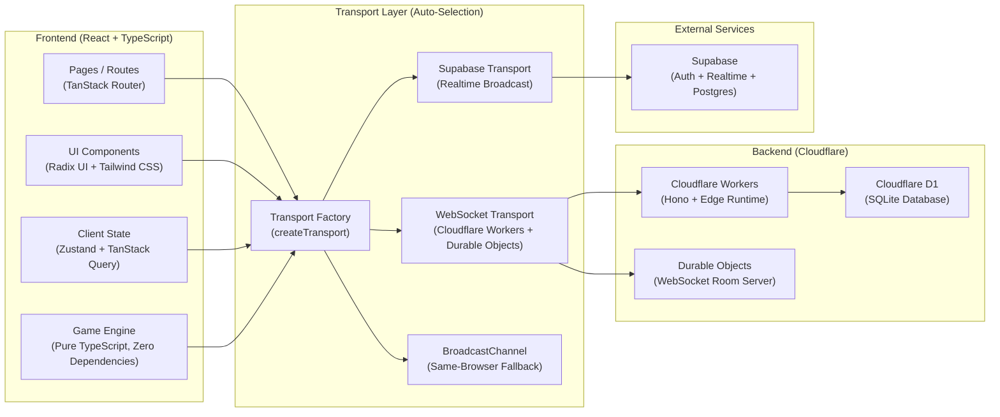

# WildCards — UNO Online

> A production-quality, browser-based multiplayer UNO game built with React, TypeScript, and Cloudflare Workers. Play with friends or bots in real time — no downloads, no accounts required.

<p align="center">
  <a href="https://wildcards.itzbyteglitch.qzz.io"></a>
  <a href="https://github.com/ItzByteGlitch/WildCards"></a>
</p>

## Features

- **Real-time Multiplayer** — WebSocket-powered rooms with Cloudflare Durable Objects
- **Cross-device Sync** — Play across desktop and mobile browsers
- **Smart Bots** — AI opponents with strategic play
- **Guest Login** — Jump in instantly with a username and avatar
- **Room System** — Create private/public rooms and invite by 6-letter code
- **Complete UNO Rules** — Draw, Skip, Reverse, Draw Two, Wild, Wild Draw Four
- **Turn Timer** — Configurable turn limits with visual indicator
- **Score Tracking** — Persistent stats, wins, and leaderboard
- **Dark/Light Mode** — System-aware theming
- **Responsive Design** — Desktop, tablet, and mobile support
- **Accessibility** — Keyboard navigation and screen reader support
- **Free Hosting** — Designed to run on Cloudflare's free tier

## AI-Assisted Development

AI was integrated throughout our development process — from **planning and architecture to coding, debugging, UI refinement, and testing**.

### 01 — Custom AI Agent

Our own AI coding agent, **inspired by Claude Code™**, customized around our development workflow. Currently in **beta and not publicly released**.

### 02 — Multi-Model Engineering

We worked with multiple AI models for different workloads, including **NVIDIA Nemotron 3 Ultra, NVIDIA Nemotron Nano 12B v2 VL, Cohere North Mini Code, Kimi K2.7 Code, MiniMax M3, and ChatGPT**.

### 03 — Automated Review Workflow

We implemented a workflow that **visually inspects the UI and analyzes application logs** to identify errors, inconsistencies, and design imperfections. This helped us continuously refine both **functionality and user experience**.

### AI With Human Oversight

We did not use AI blindly. We **reviewed, tested, verified, and understood its outputs** before integrating them into the project.

> **The skill is not just using AI — it is knowing how to use it correctly, efficiently, and ethically.**

**AI accelerated our development. Human judgment remained responsible for the final decisions.**

## Technologies

### Frontend

[](https://www.typescriptlang.org/)
[](https://react.dev/)
[](https://vite.dev/)
[](https://tailwindcss.com/)
[](https://tanstack.com/router)
[](https://tanstack.com/query)
[](https://zustand-demo.pmnd.rs/)
[](https://motion.dev/)
[](https://www.radix-ui.com/)

### Backend & Infrastructure

[](https://workers.cloudflare.com/)
[](https://developers.cloudflare.com/d1/)
[](https://pages.cloudflare.com/)
[](https://developers.cloudflare.com/durable-objects/)
[](https://developer.mozilla.org/en-US/docs/Web/API/WebSocket)
[](https://hono.dev/)

### Database & Services

[](https://supabase.com/)
[](https://www.sqlite.org/)

### Tooling

[](https://eslint.org/)
[](https://prettier.io/)
[](https://nodejs.org/)
[](https://pnpm.io/)
[](https://tanstack.com/start)

### Project Status

[](https://opensource.org/licenses/MIT)
[](https://github.com/itzByteGlitch/WildCards/actions/workflows/ci.yml)
[](https://wildcards.itzbyteglitch.qzz.io)

## Architecture



## Game Engine

The UNO engine (`src/lib/uno/`) is completely decoupled from the UI:

- **Pure TypeScript** — No React, DOM, or side effects
- **Server-authoritative** — Clients send intents; the server validates them
- **Deterministic** — Same seed produces the same shuffle
- **Testable** — Unit-testable without a browser

```typescript
import { createGame, applyAction } from "@/lib/uno/engine";

const seats = [
  { id: "p1", name: "Alice", avatar: "🐱", isBot: false },
  { id: "p2", name: "Bob", avatar: "🤖", isBot: true },
];

const game = createGame(seats);

const { state, error } = applyAction(game, {
  type: "play",
  playerId: "p1",
  cardId: "card_123",
});
```

## Realtime Transport

The transport layer automatically selects the best available backend:

1. **WebSocket + Durable Objects** — If `VITE_REALTIME_WS_URL` is configured
2. **Supabase Broadcast** — If Supabase credentials are present
3. **BroadcastChannel** — Same-browser cross-tab fallback

All transports implement the same `Transport` interface for seamless switching.

## Project Structure

```text
WildCards/
├── src/
│   ├── components/          # Reusable UI components
│   │   ├── ui/              # Radix-based design system
│   │   ├── uno-card.tsx     # UNO card component
│   │   ├── game-board.tsx   # Game board layout
│   │   └── site-nav.tsx     # Navigation
│   ├── hooks/               # Custom React hooks
│   ├── integrations/        # External service integrations
│   │   └── supabase/        # Supabase client & auth
│   ├── lib/
│   │   ├── net/             # Transport abstractions
│   │   ├── uno/             # Game engine
│   │   ├── rooms.server.ts
│   │   ├── rooms.functions.ts
│   │   ├── profile.ts
│   │   └── store/           # Client state (Zustand)
│   ├── routes/              # Application routes
│   ├── styles.css
│   └── server.ts
├── worker/
│   └── src/index.ts
├── supabase/
└── public/
```

## Getting Started

### Prerequisites

- Node.js 22+
- pnpm 9+ (or npm/yarn)
- Cloudflare account for deployment

### Installation

```bash
git clone https://github.com/ItzByteGlitch/WildCards.git
cd WildCards
pnpm install
pnpm run dev
```

The app will be available at `http://localhost:5173`.

### Environment Variables

Create a `.env` file in the root:

```env
VITE_SUPABASE_URL=your_supabase_url
VITE_SUPABASE_PUBLISHABLE_KEY=your_supabase_anon_key
VITE_REALTIME_WS_URL=wss://your-worker.your-subdomain.workers.dev
CLOUDFLARE_ACCOUNT_ID=your_account_id
CLOUDFLARE_API_TOKEN=your_api_token
```

## Deployment

### Frontend — Cloudflare Pages

```bash
pnpm run build
npx wrangler pages deploy .output/public --project-name=wildcards
```

### Backend — Cloudflare Workers + Durable Objects

```bash
cd worker
pnpm install
npx wrangler deploy
```

Set `VITE_REALTIME_WS_URL` in your Pages environment variables to the Worker URL.

### Database — Cloudflare D1

```bash
npx wrangler d1 create wildcards
npx wrangler d1 execute wildcards --file=./supabase/migrations/*.sql
```

## Scripts

| Command | Description |
| --- | --- |
| `pnpm dev` | Start development server |
| `pnpm build` | Build for production |
| `pnpm preview` | Preview production build |
| `pnpm lint` | Run ESLint |
| `pnpm format` | Format with Prettier |
| `pnpm typecheck` | Run TypeScript type checking |

## Contributing

1. Fork the repository
2. Create a feature branch: `git checkout -b feature/amazing-feature`
3. Commit your changes
4. Push the branch
5. Open a Pull Request

Before submitting, ensure `pnpm lint` and `pnpm typecheck` pass and follow the existing code style.

## License

This project is licensed under the MIT License — see the [LICENSE](LICENSE) file for details.

## Acknowledgments

- [TanStack](https://tanstack.com/) for the router, query, and start frameworks
- [Radix UI](https://www.radix-ui.com/) for accessible component primitives
- [Cloudflare](https://cloudflare.com/) for its infrastructure and free tier
- [Supabase](https://supabase.com/) for realtime infrastructure
- UNO® is a registered trademark of Mattel. This is an unofficial fan project.

---

<p align="center">
  Made by <a href="https://github.com/ItzByteGlitch">ItzByteGlitch (Divyansh Singh Patel)</a>
</p>
